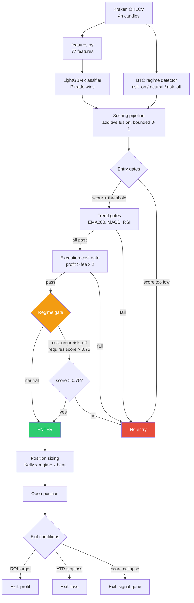

# Architecture

The signal-to-trade pipeline, end to end.

## Reading the diagram

The **regime gate** (orange) is the critical control point. It was updated in
June 2026 after dryrun data showed `risk_on` entries had a 23% win rate. Now
only the `neutral` regime trades freely; both `risk_on` and `risk_off` require
an exceptional score (> 0.75) to enter.

The pipeline is deliberately a series of **gates that reject**, not a single
score that triggers. A signal must survive every gate to become a trade. This
is what keeps trade frequency low and quality high — most candidates are
rejected, by design.

See [METHODOLOGY.md](METHODOLOGY.md) for component details and
[RESULTS.md](RESULTS.md) for what the live dryrun showed.
