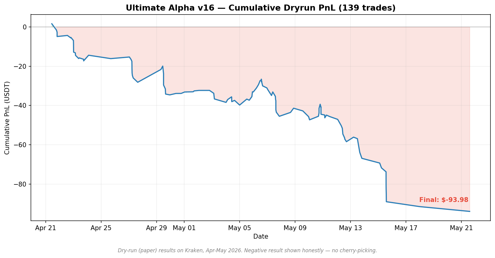

# Freqtrade ML Strategy — UltimateAlphaV16


A Freqtrade trading strategy that uses a LightGBM classification model with 77 engineered features to score entry setups on crypto perpetual pairs. Includes regime-aware position sizing, ATR-based volatility-scaled stops, and a tiered ROI exit table.

This repo documents both the working strategy AND the research process — including strategies that were tested and rejected. Honest backtesting is the point.



> Real dry-run result: **-$93.98 across 139 trades** (Apr–May 2026, Kraken paper trading).
> This is shown deliberately. The strategy is not yet profitable — the value here is
> the honest measurement and the data-driven changes that followed. See [RESULTS.md](RESULTS.md).

## What's here

See [ARCHITECTURE.md](ARCHITECTURE.md) for the full signal-to-trade pipeline diagram.

- **`ultimate_alpha_v16.py`** — The main strategy class, ~1000 lines. Custom entry signals (model prob + technical scoring + regime adjustment), custom stoploss (ATR-scaled), custom exit logic, Kelly criterion position sizing.
- **`features.py`** — Feature engineering pipeline. 77 features: momentum (RSI multi-timeframe, MACD), volatility (ATR percentile, Bollinger position), volume profile, cross-pair rank, regime indicators.
- **`train_model.py`** — Model training script with proper time-series splits (no lookahead leak), target labeling (return > X% within N candles), and out-of-sample validation.
- **`backtest_notebooks/`** — Jupyter notebooks documenting backtests and rejection rationale for several strategies:
  - `grid_trading.ipynb` — Rejected. Mean -2.06% across 60d windows on BTC.
  - `mean_reversion_1h.ipynb` — Rejected. All 10 pairs negative 4h forward return.
  - `mean_reversion_72h.ipynb` — Rejected. +0.79% raw but -0.90% net with TP/SL.
  - `relative_strength_momentum.ipynb` — Rejected. Gross -5.67%, max DD 51.95%.
  - `trend_following_daily.ipynb` — PASSED. +19.15% combined ROI over the test window.
  - `ml_v16_validation.ipynb` — Walk-forward validation of the production model.

## Why this repo exists

Most "trading bot" repos on GitHub show their winning strategies in their best light. This repo shows the full research record — including the four strategies I built, backtested, and killed because the data said no.

That discipline (testing honestly, refusing to deploy strategies without edge, accepting flat or negative results when they're true) is harder than building the code. I wanted a portfolio piece that demonstrated the research process, not just the result.

## Tech stack

- Python 3.12
- Freqtrade 2026.x
- LightGBM (gradient-boosted trees)
- pandas, NumPy
- scikit-learn (validation utilities)
- TA-Lib / pandas-ta (indicators)

## Key design decisions

- **4h timeframe** chosen for signal-to-noise tradeoff. Shorter timeframes were tested and showed worse net returns after fees.
- **Custom stoploss returns hard stop (not trailing)** — earlier versions used trailing stops that "destroyed winners" per backtest. The current stop scales with ATR but never tightens with profit.
- **ROI table is tiered by candle age** — `0: 6%, 240: 4%, 1440: 3%, 4320: 1.5%, 10080: 0%`. Trades that haven't reached profit by 7 days exit at scratch.
- **Kelly fraction = 0.35** for position sizing. Full Kelly is mathematically optimal but practically reckless; fractional Kelly with 0.25-0.4 is the standard real-world adjustment.
- **Regime-conditional entry threshold** — base threshold is 0.58, lowered by 0.05 in risk-on regimes, raised by 0.08 in risk-off. Adapts to market conditions without retraining.

## Current status

Production dry-run on Kraken across 17 USDT pairs. Trade history and metrics published in `results/` folder (updated periodically).

This is NOT financial advice and the strategy is NOT proven to be profitable in live trading. Results in dry-run do not guarantee live performance. Use at your own risk and only with capital you can afford to lose entirely.

## Setup

```bash
# Install Freqtrade
pip install freqtrade

# Clone and copy strategy
git clone https://github.com/OfficialGIGA/freqtrade-ml-strategy.git
cp freqtrade-ml-strategy/ultimate_alpha_v16.py ~/freqtrade/user_data/strategies/
cp freqtrade-ml-strategy/features.py ~/freqtrade/user_data/strategies/

# Configure (edit with your exchange + Telegram credentials)
cp config.example.json ~/freqtrade/user_data/config.json

# Train model (one-time, requires historical data)
python3 train_model.py --pairs BTC/USDT ETH/USDT --timerange 20230101-

# Run in dry-run
freqtrade trade --strategy UltimateAlphaV16 --config user_data/config.json
```

## License

MIT — fork freely. Strategies are for educational purposes.
